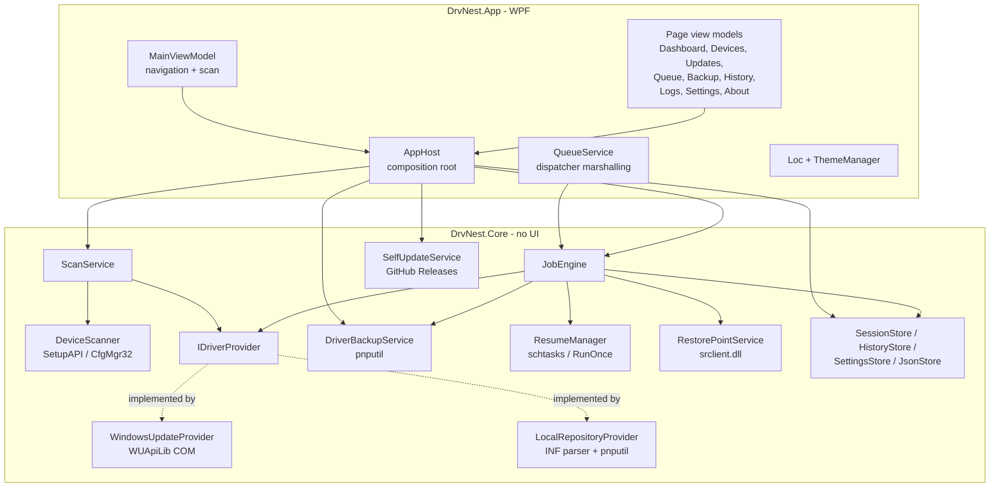
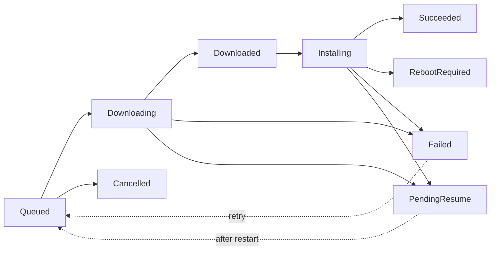

# Architecture

How DrvNest is put together, and why it is put together that way.

Everything below describes code that exists in this repository. Where a design decision
looks unusual, the reason is given rather than assumed.

---

## 1. Project layout

```
src/
├── DrvNest.Core/     UI-free domain logic          (net8.0-windows, class library)
├── DrvNest.App/      WPF desktop application       (net8.0-windows, WinExe, DrvNest.exe)
└── DrvNest.Cli/      reserved for a headless front end (placeholder, no code yet)
```

**`DrvNest.Core`** contains everything that is not a window: device scanning, the driver
providers, the job engine, persistence, backup/restore, reboot resume, the restore point
service and the self-updater. It references no WPF type and no NuGet package. Anything in
here can be driven from a console host, a service or a test harness.

**`DrvNest.App`** is the WPF shell. It owns the composition root, the view models, the
localisation table, the theme manager and the dispatcher marshalling. It is the only
project that knows a UI thread exists.

**`DrvNest.Cli`** is currently an empty directory kept as the place a headless front end
would go. The `Core` API surface is already shaped for it — nothing in `Core` calls back
into the UI, it only raises events.

Both executable-facing projects target `net8.0-windows`. `Core` targets the Windows TFM
too, deliberately: it talks to SetupAPI, CfgMgr32, the registry and the Windows Update
Agent, and the Windows TFM provides `Microsoft.Win32.Registry` without a package
reference.

### Component diagram



---

## 2. Composition root

`DrvNest.App/Services/AppHost.cs` is a hand-written static container: nine singletons,
created once in a fixed order in `Initialize(LaunchMode)`.

There is no `Microsoft.Extensions.DependencyInjection`. The reason is size and
independence, not ideology: every package left out is weight removed from a single-file
executable that people download onto a machine with nothing installed on it. Nine
singletons with an obvious construction order do not need a container.

Construction order matters in two places:

- `Backup` is built with a lambda that reads `Settings.Current.BackupRoot` **lazily**, so
  changing the backup folder at runtime takes effect without rebuilding the service.
- `Queue` (the `QueueService`) must be created after `Jobs` (the `JobEngine`), because it
  subscribes to the engine's events in its constructor.

`Initialize` also decides offline behaviour: `OfflineMode` in settings **or**
`LaunchMode.Rescue` disables the Windows Update provider before the first scan can run.

---

## 3. The `IDriverProvider` abstraction

`DrvNest.Core/Abstractions/IDriverProvider.cs`:

```csharp
public interface IDriverProvider
{
    ProviderKind Kind { get; }
    string DisplayName { get; }
    bool IsAvailable { get; }
    string? UnavailableReason { get; }

    Task<IReadOnlyList<UpdateCandidate>> SearchAsync(
        IReadOnlyList<DeviceItem> devices, CancellationToken cancellationToken);

    Task<ProviderResult> DownloadAsync(
        DriverJob job, Action<JobProgress> progress, CancellationToken cancellationToken);

    Task<ProviderResult> InstallAsync(
        DriverJob job, Action<JobProgress> progress, CancellationToken cancellationToken);
}
```

Two implementations ship today:

| Implementation | Source | Download step | Install step |
| --- | --- | --- | --- |
| `WindowsUpdateProvider` | Microsoft Update via the Windows Update Agent COM API | `IUpdateDownloader` | `IUpdateInstaller` |
| `LocalRepositoryProvider` | Folders of `.inf` packages | Stages the package folder into `%ProgramData%\DrvNest\cache\staged\<jobId>` | `pnputil /add-driver <inf> /install`, then `pnputil /scan-devices` |

Both the scan pipeline and the job engine only ever see the interface, which is what makes
a third source (a vendor catalog, a WSUS server, a network share with its own index) an
additive change.

### Contract rules

- **Never throw for an expected failure.** No network, a disabled service, a folder that
  does not exist — report it through `IsAvailable` / `UnavailableReason` and return an
  empty list. `ScanService` turns that into a warning line instead of an aborted scan.
- **`SearchAsync` and `DownloadAsync` must be safe to call concurrently.** The scan queries
  every provider in parallel and the job engine downloads several jobs at once.
- **`InstallAsync` is called under a global lock** held by the job engine. An
  implementation does not need its own install serialisation, but it must not assume it is
  the only process installing drivers on the machine either — `WindowsUpdateProvider`
  still retries `WU_E_OPERATIONINPROGRESS` up to six times at ten-second intervals, because
  Windows itself may be installing something.
- A provider may report `RebootRequired` on a *failed* result to mean "restart first, then
  this can be installed". The engine parks the job as `PendingResume` rather than failing it.

### Adding a provider

1. Add a value to `ProviderKind` in `Core/Models/Enums.cs`.
2. Implement `IDriverProvider`. Project whatever the source offers onto `UpdateCandidate`:
   `ProviderId` is your stable identifier, `TargetHardwareIds` is what deduplication and
   the ignore list match on, `CurrentVersion` left null marks a first-time install.
3. Register it in `AppHost.Initialize`, in the `Providers` array.

That is the whole change. `ScanService`, `JobEngine`, the queue, the history and every view
work off the interface and the shared models.

Ordering in the `Providers` array is not significant for correctness, but deduplication in
`ScanService.Deduplicate` prefers `ProviderKind.LocalRepository` when two sources offer the
same `hardware id + version` pair, because a local package installs without a network.

---

## 4. Scanning

`DeviceScanner` (`Core/Scanning/DeviceScanner.cs`) enumerates devices through
`SetupDiGetClassDevs(null, null, 0, DIGCF_PRESENT | DIGCF_ALLCLASSES)` and, per device:

| Data | Source |
| --- | --- |
| Device instance id | `CM_Get_Device_ID` (sized with `CM_Get_Device_ID_Size`) |
| Description, friendly name, class, class GUID, manufacturer | `SetupDiGetDeviceRegistryProperty` (`SPDRP_*`) |
| Hardware ids, compatible ids | `SPDRP_HARDWAREID`, `SPDRP_COMPATIBLEIDS` (REG_MULTI_SZ) |
| Driver key | `SPDRP_DRIVER`, e.g. `{4d36e968-…}\0000` |
| Installed version / date / provider / INF name | `HKLM\SYSTEM\CurrentControlSet\Control\Class\<DriverKey>` values `DriverVersion`, `DriverDate`, `ProviderName`, `InfPath` |
| Health | `CM_Get_DevNode_Status` → `DN_HAS_PROBLEM` + problem code |
| Class description | `SetupDiGetClassDescription`, cached per class GUID |

Problem codes are mapped in `ReadStatus`:

| Problem code | `DeviceHealth` |
| --- | --- |
| 28 `CM_PROB_FAILED_INSTALL`, 1 `NOT_CONFIGURED`, 19 `REINSTALL` | `DriverMissing` |
| 22 `DISABLED`, 29 `HARDWARE_DISABLED`, 32 `DISABLED_SERVICE` | `Disabled` |
| 14 `NEED_RESTART` | `RestartPending` |
| anything else with the problem flag set | `Faulty` |
| no problem flag, but no driver key and no version | `DriverMissing` |

A device node that cannot be queried at all is treated as healthy rather than alarming —
it is almost always a ghost entry.

### Why no WMI

WMI is the obvious way to ask Windows about hardware, and it is the wrong tool here for
three reasons:

1. **The target machine is a fresh install.** A machine minutes out of a format is exactly
   where a WMI repository is most likely to be still building or subtly broken, and
   `Win32_PnPEntity` queries are slow on top of that.
2. **SetupAPI has strictly more information.** Multi-valued hardware and compatible ids,
   the driver key, and the live Configuration Manager problem code are what driver matching
   actually needs, and they come straight from the source of truth.
3. **It is a service dependency.** SetupAPI, CfgMgr32 and the registry are DLLs that ship
   with every Windows install and need nothing running.

The same reasoning applies to `RestorePointService`, which calls `SRSetRestorePointW` in
`srclient.dll` instead of the WMI `SystemRestore` class.

### Why no NuGet dependencies

Neither project references a NuGet package. There is one COM reference (WUApiLib, generated
from the type library that already exists on the machine) and nothing else. This is a
deliberate constraint with three payoffs:

- The single-file executable stays around 65 MB instead of growing with transitive
  dependencies, and download size matters when someone is fetching it on a phone tether.
- There is no supply chain to audit for a tool that installs drivers with an elevated token.
- Nothing has to be restored from the internet to build it beyond the .NET SDK itself.

The cost is a hand-rolled logger, a hand-rolled string table, a hand-rolled container and a
minimal INF parser. All four are small and boring, which is the point.

---

## 5. The job engine

`Core/Jobs/JobEngine.cs`. One queue, one lifecycle, two concurrency rules.



### Concurrency model

```csharp
using var slots = new SemaphoreSlim(settings.MaxParallelJobs, settings.MaxParallelJobs);
private readonly SemaphoreSlim _installLock = new(1, 1);
```

- **Downloads are parallel.** Each job takes a slot from `slots`, sized by
  `AppSettings.MaxParallelJobs` (default 3, clamped to 1–8). Downloads are network bound
  and genuinely overlap.
- **Installs are serialised.** A single process-wide `_installLock` with one permit is held
  across the whole install phase of a job.

The install lock is the one design decision most likely to be mistaken for laziness, so:
Windows Update returns `WU_E_OPERATIONINPROGRESS` (0x80240016) when a second installation
starts while one is running, and the PnP subsystem serialises `pnputil` regardless. Running
installs concurrently would not make anything faster; it would produce a nicer-looking
progress screen and a pile of spurious failures on exactly the machines that can least
afford them.

Note that the slot is held for the *whole* job, download and install together. With
`MaxParallelJobs = 3`, at most three jobs are in flight, at most one of them is inside the
install lock, and the other two are downloading or waiting.

### Per-job flow

1. Take a download slot.
2. For attempt 1..`MaxRetryAttempts + 1` (default 3 attempts total, 3-second delay before
   a retry):
   - `provider.DownloadAsync` with throttled progress; a `SpeedMeter` smooths the transfer
     rate with an exponential moving average.
   - Take the install lock.
   - Export the driver being replaced (`BackupExistingDriverAsync`) when
     `BackupBeforeUpdate` is on and this is an upgrade rather than a first install. A failed
     backup logs a warning and never blocks the update.
   - `provider.InstallAsync`.
   - Release the install lock.
3. Append a `HistoryRecord`, flag the session dirty, release the slot.

### Preflight and completion

Preflight (`PreflightAsync`) registers the resume hook **first**, so a machine that dies
during preflight still comes back. Then, for a non-resumed run, it warns if Windows already
has a restart pending and creates the restore point.

On completion (`FinishAsync`): if anything needs a restart or is parked, the session is
marked rebooting and flushed, and the resume hook is re-armed. If nothing is left, the
session file is deleted and the resume hook is removed — DrvNest leaves nothing behind on
the machine.

---

## 6. Reboot-resume design

Three pieces have to line up for "continue after restart" to work in practice.

### 1. State that survives a power cut

`SessionState` is persisted to `%ProgramData%\DrvNest\session.json` by `SessionStore`.
Writes are debounced on a 1-second timer (`Touch()` marks dirty, the timer flushes) and
forced synchronously (`Flush()`) before a restart is scheduled.

Every write goes through `JsonStore.Write`, which is atomic:

```
write to <path>.tmp → flush to disk → File.Replace (or File.Move when no original exists)
```

A half-written file therefore cannot destroy a running recovery session. `JsonStore.Read`
quarantines an unreadable file as `<name>.corrupt-<timestamp>` instead of failing forever.

The history file is JSON-lines and append-only for the same reason: a crash mid-write costs
at most the last record, and `ReadLines` skips a truncated final line.

### 2. Getting the process back

`ResumeManager.EnableAsync()` tries two mechanisms, in order:

```
schtasks /Create /TN "DrvNest\ResumeSession" /TR "\"<exe>\" --resume"
         /SC ONLOGON /RL HIGHEST /F
```

A scheduled task is preferred because it survives **several** restarts, which matters: a
batch of drivers routinely needs more than one. `/RL HIGHEST` is required — the resumed
process installs drivers.

If Task Scheduler is unavailable, it falls back to
`HKLM\SOFTWARE\Microsoft\Windows\CurrentVersion\RunOnce`, value `DrvNestResume`. RunOnce
fires exactly once and deletes itself, which is why it is the fallback and not the primary.

`DisableAsync()` removes both, and is called whenever a queue finishes with nothing pending.

### 3. Picking up where it stopped

`App.OnStartup` parses the launch mode; `RunStartupFlowAsync` loads the session.
`SessionStore.Load()` refuses to resume when:

- the schema version is not 1,
- `MachineName` does not match this machine,
- `RebootCount` exceeds `SessionState.MaxRebootCount` (10) — the safety valve against a
  driver that requests a restart forever,
- there are no jobs, or every job is already terminal.

In each of those cases the file is deleted rather than retried.

A session is **only continued automatically** when the process was launched by the resume
task (`--resume`). A manual launch shows the queue with a *Continue* button instead, because
silently installing drivers the moment a window opens is not a defensible default.

`WindowsUpdateProvider` has a matching detail: after a reboot its live `IUpdate` COM cache
is empty, so `ResolveUpdate` re-queries Windows Update once (under `_searchGate`, so several
resumed jobs share one search) to repopulate it.

---

## 7. Persistence layout

Everything lives under `%ProgramData%\DrvNest` — not `%AppData%` — because the resume task
may run as a different administrator account or as SYSTEM after a restart and must still
find the same session file. `AppPaths.EnsureCreated()` falls back to
`%LocalAppData%\DrvNest` if ProgramData is not writable.

| Path | Contents |
| --- | --- |
| `settings.json` | `AppSettings`, normalised and range-clamped on load |
| `session.json` | The resumable queue |
| `history.jsonl` | Append-only history, one JSON object per line |
| `logs/drvnest.log` | Rolling text log (8 MB cap) |
| `backups/` | Exported driver packages; `backups/rollback/` holds pre-update exports |
| `cache/` | `staged/<jobId>` for local packages, `self-update/` for downloaded releases, `restore/` for extracted ZIPs |
| `reports/` | Hardware reports and history CSV exports |
| `<exe folder>\Drivers` | Portable repository, auto-registered by `SettingsStore` when present |

---

## 8. Deployment: self-contained, single file

From `DrvNest.App.csproj`:

| Property | Value | Why |
| --- | --- | --- |
| `SelfContained` | `true` | The target machine has no .NET runtime and possibly no network to get one |
| `PublishSingleFile` | `true` | One file to copy onto a USB stick |
| `IncludeNativeLibrariesForSelfExtract` | `true` | Native WPF libraries have to come along |
| `EnableCompressionInSingleFile` | `true` | ~65 MB instead of ~150 MB |
| `PublishReadyToRun` | `true` | Faster cold start on a bare install |
| `PublishTrimmed` | **`false`** | Trimming breaks WPF's reflection over XAML types and the COM interop with WUApiLib |
| `SupportedOSPlatformVersion` | `10.0.14393.0` | Windows 10 1607 |

NativeAOT is not used for the same reason trimming is disabled: WPF is not supported under
it, and the WUA interop is entirely reflection- and COM-based.

WPF's runtime pack ships private copies of `vcruntime140_cor3.dll` and
`msvcp140_cor3.dll`, so no Visual C++ Redistributable is needed either. The only remaining
requirement on the target machine is Windows itself.

`app.manifest` requests `requireAdministrator`, declares per-monitor v2 DPI awareness,
opts into long paths (driver store paths get deep) and sets the active code page to UTF-8.

---

## 9. Localisation

`DrvNest.App/Services/Loc.cs` is a static string table: two `Dictionary<string, string>`
instances (`Turkish`, `English`) and a `T(key)` lookup that falls back to English and then
to the key itself.

A RESX + satellite assembly setup would fight the single-file publish configuration
(`SatelliteResourceLanguages` is pinned to `en` in `Directory.Build.props`), and this
application has a few hundred strings rather than a few thousand.

`SetLanguage` also sets `CultureInfo.DefaultThreadCurrentCulture` / `…UICulture` and raises
`LanguageChanged`. `MainViewModel` handles that by **rebuilding** pages rather than
re-binding them: views resolve their strings through a markup extension at parse time, so
`NavItem.ResetView()` discards the cached view and the next navigation constructs it fresh.
Cheap, and it removes a whole class of stale-text bugs.

### Adding a language

1. Copy the `English` dictionary in `Loc.cs`, translate the values, name it e.g. `German`.
2. Add a case to `SetLanguage`, and set the `CultureInfo` for it.
3. Add the code to `LanguageOptions` in `SettingsViewModel` and to the allowed values in
   `AppSettings.Normalize()` (which currently resets anything that is not `tr` or `en`).

Keys missing from a new dictionary fall back to English automatically, so a partial
translation is usable from the first commit.

---

## 10. Theming

Two palette dictionaries, `Themes/Palette.Dark.xaml` and `Themes/Palette.Light.xaml`,
declare an identical set of brush keys. Every control style in `Themes/Controls.xaml`
references colours through `DynamicResource`.

`ThemeManager.Apply(theme)` finds the palette among
`Application.Current.Resources.MergedDictionaries` and replaces it **in place**, keeping its
index. Because the lookups are dynamic, the live visual tree re-themes without recreating a
single control, and because the palette keeps its position, the control styles merged after
it keep resolving.

The theme is applied immediately when the user picks it in Settings, before Save — a theme
picker that needs a confirmation click feels broken.

---

## 11. UI ↔ Core boundary

`Core` never touches a `Dispatcher`. The job engine raises three plain events
(`JobChanged`, `StatusChanged`, `Completed`) and `QueueService` in the App project is the
single place that marshals them onto the UI thread.

`QueueService` also owns the `ObservableCollection<DriverJob>` that both the Updates page
and the Activity page bind to — the same job instances, not two copies that can drift.

`DriverJob` itself implements `INotifyPropertyChanged` and is simultaneously the object
serialised into `session.json`. Live-only values (`SpeedBytesPerSecond`) and derived values
(`OverallPercent`, `TransferDisplay`) are marked `[JsonIgnore]`, so the persisted shape stays
meaningful after a restart. `UpdateCandidate` deliberately stays a plain data object;
`CandidateItem` in `UpdatesViewModel` wraps it when the UI needs change notification.

Cross-page messages (navigation requests, status text, scan completion) go through the
static `AppEvents` bus rather than view models referencing each other.
